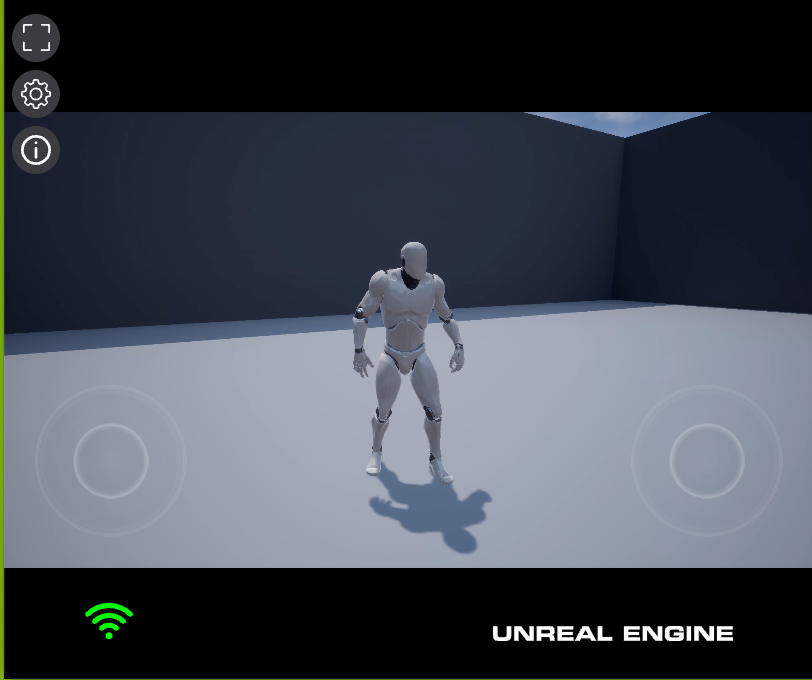

# Unreal Engine Sample Project

This is a sample project using the Unreal Engine. You can use this to generate a container image on Linux as part of the [The Unreal Pixel Streaming On Azure Kubernetes Service!](https://github.com/appdevgbb/az-aks-unreal-pixel-streaming) repo.

